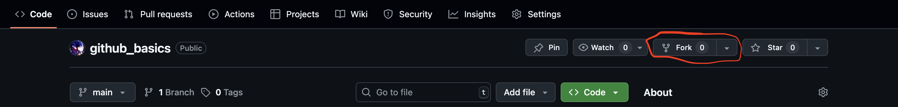
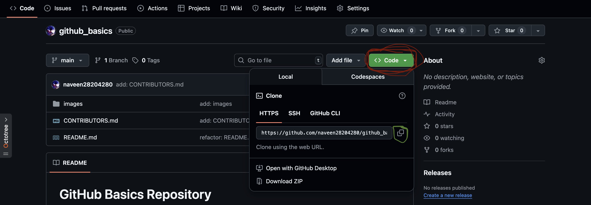

# GitHub Basics Repository

This repository is a hands-on sandbox for anyone learning how to use Git and GitHub. Whether you're just starting out or need structured practice, this will walk you through everything from cloning to making pull requests. The goal: **make you comfortable with version control and collaborating on open-source platforms.**

---

## What You'll Learn

- Basic Git commands
- Setting up Git
- Forking and cloning repositories
- Working with branches
- Committing and pushing changes
- Creating pull requests
- Resolving merge conflicts
- Collaborating with others

---

## 🔧 Setup Instructions

### 1. Install Git

Check if Git is already installed:

```bash
git --version
```

If not, download from [https://git-scm.com/downloads](https://git-scm.com/downloads)

### 2. Configure Git

```bash
git config --global user.name "Your Name"
git config --global user.email "youremail@example.com"
```

---

## Workflow Summary for our exercise

```
FORK → CLONE → BRANCH → COMMIT → PUSH → PULL REQUEST → MERGE
```

---

## 🛠️ Step-by-Step Instructions

### Fork the Repository

Forking creates a personal copy of someone else’s repository on your GitHub account. It lets you freely experiment with changes without affecting the original project

#### How to fork a repo

1. Go to the repo page on GitHub
2. Click the **Fork** button on the top-right

3. Now edit the name to suit you and click on create fork


#### How to clone a repository

1. Go to the repo page on github
2. Click on the green `Code button` and then copy the link

3. Now open your terminal run this command

```bash
git clone your-repo-link
cd github-basics # to enter the repo
```

---

### Create a Branch (Not Needed for this exercise)

A branch is a separate line of development. It allows you to work on features or fixes without touching the main codebase until you’re ready

#### How to create a branch

```bash
git checkout -b your-branch-name
```

---

### Add your name to the 'Make your Work Permanent' section

Open this file in your preferred code editor and add your name to the table [here](#make-your-work-permanent)

---

### Stage and Commit

```bash
git add .
git commit -m "add: a new feature"
```

Use clear commit messages.

---

### Push to Your Fork

```bash
git push origin your-branch-name
```

---

### Open a Pull Request (PR)

1. Go to your forked repo on GitHub
2. Click **Compare & pull request**
3. Add a title and description
4. Submit the PR to the original repo

---

To push updates to your fork:

```bash
git push origin main
```

---

## 🔀 Resolving Merge Conflicts

If there's a conflict:
HOW DO I EXPLAIN THIS

---

## Make your work permanent

| Name        | Fact about yourself     |
|-------------|--------|
| Naveen      | I love coffee, but I occasionally cheat on it with tea |


---

## 🧹 Best Practices

- Commit often, with clear messages
- Keep your branches focused on one task
- Never commit secrets (e.g. passwords, API keys)
- Pull before pushing
- Review your code before submitting PRs

---

## A Couple Useful things

- [GitHub Docs](https://docs.github.com/en/get-started/start-your-journey/hello-world)
- [Git Cheatsheet](https://education.github.com/git-cheat-sheet-education.pdf)
- [Copilot for Students](https://github.com/education/students)
- [GitHub File Icons](https://chromewebstore.google.com/detail/file-icons-for-github-and/ficfmibkjjnpogdcfhfokmihanoldbfe)
- [ani-cli](https://github.com/pystardust/ani-cli)